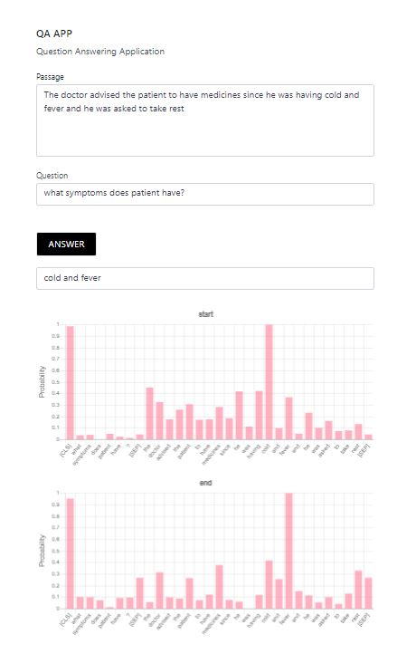

# medical_qa

This project is build using [hugging_face biobert squad model](https://huggingface.co/clagator/biobert_squad2_cased).

how to run the project
    
    # for development server
    python manage.py runserver 8010

    # for production server 
[follow steps mentioned in this link](https://medium.com/analytics-vidhya/dajngo-with-nginx-gunicorn-aaf8431dc9e0)

below is the view once you get click on **ANSWER**

Url : http://127.0.0.1:8010/project/qa/

